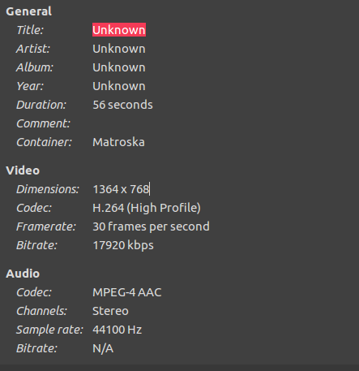

# Conceptos avanzados

## Bitrate de vídeo

Normalmente, los factores que van a determinar la calidad final de un vídeo son la resolución de este, el formato y el bitrate. La mayoría de veces nos conformamos con ver que la resolución del vídeo es 1080p o 4K, con que el vídeo esté en formato AVI que es el que más calidad tiene (aunque aumenta el tamaño de los ficheros considerablemente), y nos olvidamos de uno de los valores más importantes que afectan a la calidad general de la salida de nuestro contenido.

El bitrate de un vídeo podría traducirse como la cantidad de datos que reproduce un ordenador por segundo, el flujo de transmisión de datos, como si cada uno los píxeles de información de nuestro vídeo se trataran del caudal de un río. El bitrate se mide en kilobytes por segundo (kpbs), a mayor número de kpbs, mayor será la calidad resultante del vídeo.

No es solo un factor muy importante, sino que en muchos casos puede ser el más determinante de todos. Imagina por ejemplo grabar un vídeo en 4K con una bitrate de vídeo de 1000kpbs (que es bastante inadecuado para esa resolución). Esto sería similar a cambiarle la carrocería a un coche del desguace por la de un Ferrari y esperar que el coche corra como un Ferrari (spoiler: no pasa), al fin y al cabo, el motor sigue siendo el mismo que antes, y tal vez el coche ni arranque.

Normalmente puede conocerse el bitrate de un vídeo viendo las Propiedades del fichero resultante.

Los bitrates más usados suelen ser los siguientes:

* 240p @ H.264: 350 Kbps (2,63 MB/minuto)
* 360p @ H.264: 700 Kbps (5,25 MB/minuto)
* 480p @ H.264: 1.200 Kbps (9 MB/minuto)
* 720p @ H.264: 2.500 Kbps (18,8 MB/minuto)
* 1080p @ H.264: 5.000 Kbps (37,5 MB/minuto)
* DVD: 6.000 Kbps (45 MB/minuto)
* Blu-ray: 20.000 Kbps (150 MB/minuto)

Sin embargo, con el crecimiento de las plataformas de streaming en la última década, existen unos bitrates de vídeo recomendados para [Twitch](https://stream.twitch.tv/encoding/) y para [YouTube](https://support.google.com/youtube/answer/2853702?hl=es#zippy=). Te dejamos esta tabla resumen con las configuraciones más típicas.

| Servicio               | Bitrate (kbps)             |
|------------------------|----------------------------|
| Twitch 1080p - 60 fps  | Entre 4.500 y 6.000 Kbps   |
| Twitch 1080p - 30 fps  | Entre 3.500 y 5.000 Kbps   |
| Twitch 720p - 60 fps   | Entre 3.500 y 5.000 Kbps   |
| Twitch 720p - 30 fps   | Entre 2.500 y 4.000 Kbps   |
| Twitch 480p - 60 fps   | Entre 1.500 y 3.000 Kbps   |
| YouTube 2160p - 60 fps | Entre 20.000 y 51.000 Kbps |
| YouTube 2160p - 30 fps | Entre 13.000 y 34.000 Kbps |
| YouTube 1440p - 60 fps | Entre 9.000 y 18.000 Kbps  |
| YouTube 1440p - 30 fps | Entre 6.000 y 13.000 Kbps  |
| YouTube 1080p - 60 fps | Entre 4.500 y 9.000 Kbps   |
| YouTube 1080p - 30 fps | Entre 3.000 y 6.000 Kbps   |
| YouTube 720p - 60 fps  | Entre 2.250 y 6.000 Kbps   |
| YouTube 720p - 30 fps  | Entre 1.500 y 4.000 Kbps   |
| YouTube 480p - 60 fps  | Entre 500 y 2.000 Kbps     |
| YouTube 360p - 30 fps  | Entre 400 y 1.000 Kbps     |
| YouTube 240p - 60 fps  | Entre 300 y 700 Kbps       |

> ¡Ojo! Como ya hemos visto, el bitrate no es más que el flujo de datos transmitidos en tu grabación, por lo que si se trata de una transmisión por algún servicio de streaming como Twitch, aumentar el bitrate debe ir en función de tu velocidad de conexión (de subida).

## Codificación

Seguro que alguna vez has escuchado o leído la palabra códec o el término codificación y has sentido terror pensando que hasta aquí había llegado tu entendimiento, que habría que llamar a algún técnico para que te ayudara a configurar todo. La codificación también es un factor clave que puede hacer que tus grabaciones y transmisiones tengan una sensación de fluidez y calidad considerablemente alta una vez configurada. En pocas palabras, y sin entrar en detalles, la codificación se basa en la transformación de un elemento visual en información que será almacenada y transmitida posteriormente, una transformación de algo normalmente analógico a algo digital. En el caso de un streaming, se transformará el lienzo, el aspecto visual de nuestro streaming, compuesto por distintas fuentes de vídeo, en unos y ceros que serán transmitidos y decodificados posteriormente por los reproductores de vídeo. Al final se trata de convertir información de un sistema de datos a otro. Nuestro cerebro, después de todo, almacena la información visual que percibimos por los ojos.

Entonces, ¿qué es un códec? Un códec es un software, o un dispositivo hardware, que es capaz de codificar o decodificar una señal analógica o un flujo de datos digital. La palabra códec nace de codificador-decodificador. Además de codificar la señal, un códec puede comprimir los datos para reducir el ancho de banda de la transmisión o el espacio de almacenamiento ocupado por un archivo.