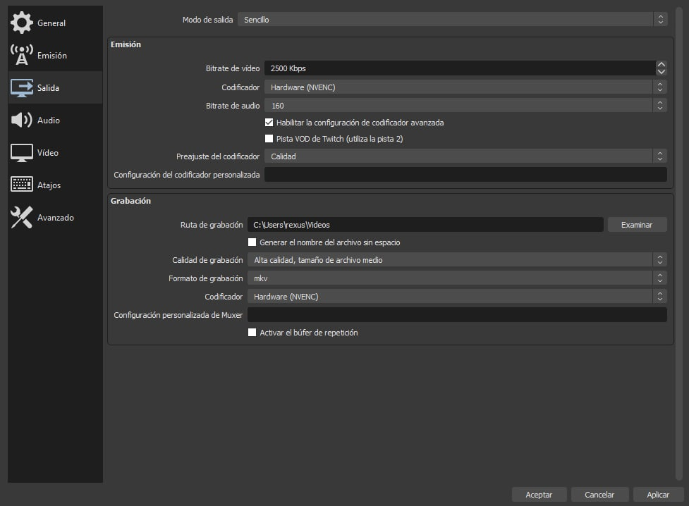
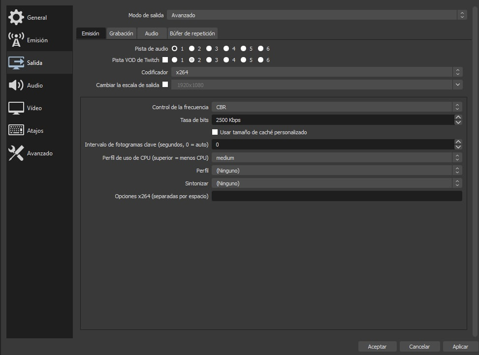

# Configuración avanzada

## Bitrate de vídeo y codificación

Para configurar el bitrate de vídeo debemos ir a la pestaña Salida de los Ajustes de OBS. En la sección Emisión podremos configurar el Bitrate de vídeo, que configuraremos en base a la resolución y tasa de cuadros por segundo seleccionada, y en función de nuestra conexión.

Respecto a la codificación, las opciones a elegir suelen ser la codificación por software y la codificación por hardware.

* La codificación por software utiliza el procesador (CPU) de nuestro ordenador para realizar la codificación, lo que suele abarcar mucho rendimiento de este, y puede resultar en un rendimiento menor.

* La codificación por hardware utiliza un códec dedicado de la tarjeta gráfica (GPU) del ordenador para realizar la codificación, lo que deja respirar a la CPU y, por lo general, resulta en un rendimiento óptimo, dejándote libertad para jugar y transmitir contenido al mismo tiempo sin cortes inesperados.

Si no puedes utilizar la codificación por hardware, intenta ser generoso en el resto de configuraciones, para no ahogar a la CPU del ordenador para realizar la codificación.

En la pestaña Salida de los ajustes podremos configurar el codificador para la Emisión y Grabación. Podemos tener un codificador distinto para cada uno. Si has seleccionado el codificador por software para las emisiones, te recomiendo cambiar el Preajuste del codificador a Rendimiento o Rendimiento Máximo y realizar pruebas con distintas configuraciones.

Si necesitas más especificidad a la hora de configurar los parámetros de Emisión, puedes cambiar el Modo de salida a Avanzado, donde se ofrecen algunas opciones más detalladas para configurar la transmisión.

