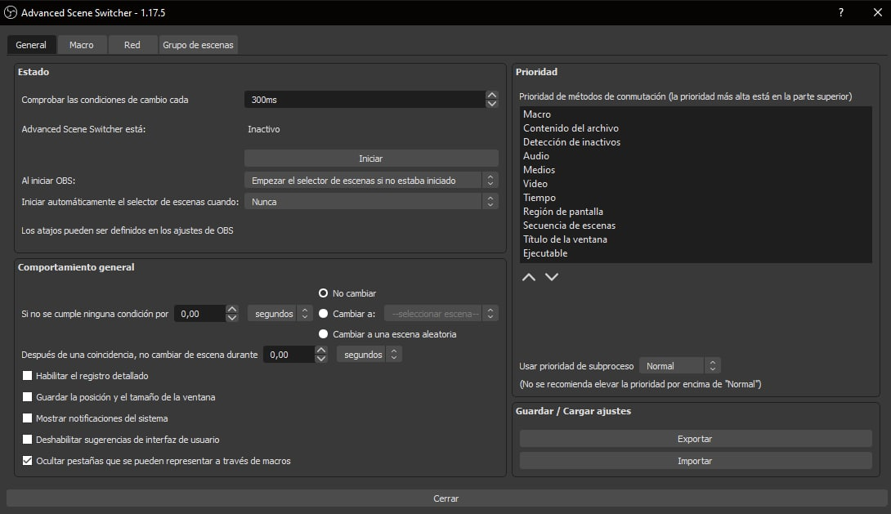
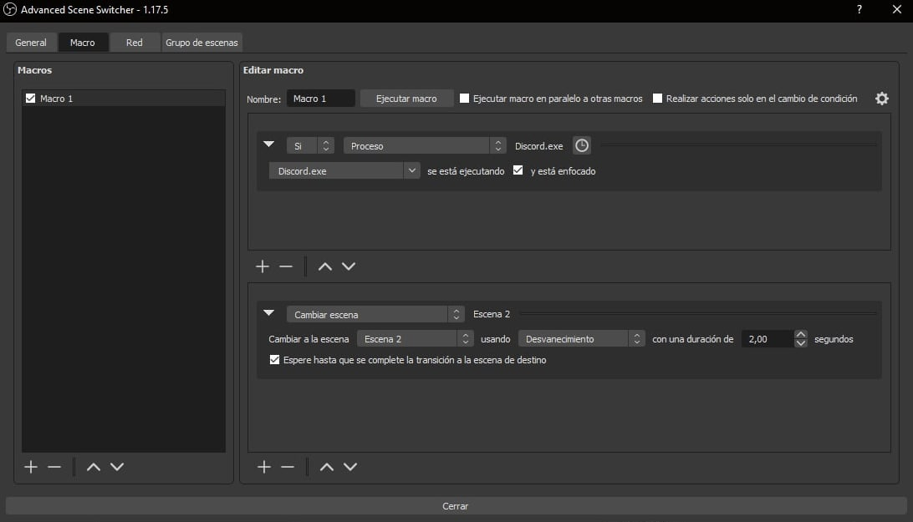

# Configuración de transiciones avanzada

Muchas veces las transiciones básicas que permite OBS y las distintas funcionalidades para manejar transiciones en OBS no son suficientes. ¿Qué pasa si quiero usar una transición distinta para cada escena? ¿Y si quiero cambiar automáticamente a una escena cuando abro un programa? ¿Y si quiero hacer esto con una escena específica?

Todo esto ya lo ha solucionado la comunidad, y es que existe un plugin completamente gratuito y de código abierto para OBS llamado Advanced Scene Switcher, el cual tiene un [repositorio en GitHub](https://github.com/WarmUpTill/SceneSwitcher).

Este plugin nos permite todo lo anterior y más, configurando Macros que escuchan los eventos ocurridos en nuestro sistema, como por ejemplo cuando se abre un programa, y que realizan transiciones especificas según las hayamos configurado.

Permite incluso controlar de forma remota las escenas de otra instancia activa de OBS en la misma red, pero ahí no entraremos, ya que es un caso de uso demasiado específico.

Las posibilidades de este plugin son infinitas, y si algo no puede hacerse aún, siempre puedes abrir una solicitud en el repositorio o intentar desarrollarla por tu cuenta, al fin y al cabo es código abierto.