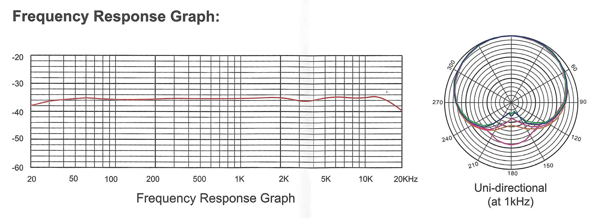
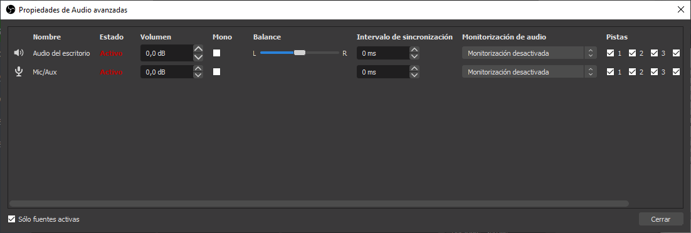
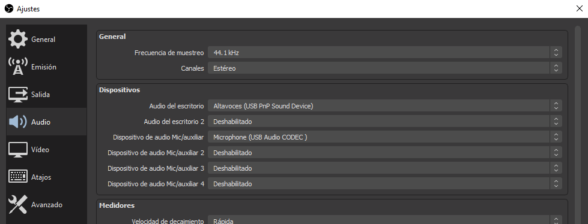
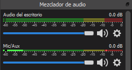
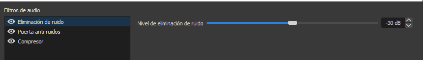
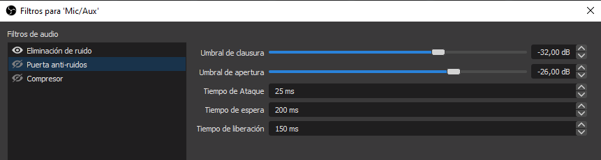
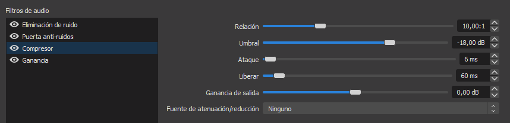
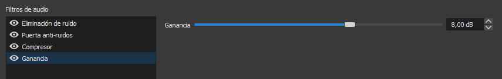

# Filtros de vídeo y audio

## Filtros de vídeo

Los filtros de vídeo pueden ayudarte a darle un toque extra a cada escena, mediante filtros de ruido o nitidez, aunque los más utilizados suelen ser las máscaras, el desplazamiento o el fondo croma. Para aplicarlos, haz clic derecho en alguna fuente y accede a Filtros. Luego, añade un filtro mediante el panel de controles inferior y reordena la prioridad con la que se aplican hasta obtener el resultado esperado.

## Cómo posicionar tu micrófono

Antes de pasar a la configuración del audio y los filtros de audio, debemos tener bien posicionado nuestro micrófono, ya sea integrado en el portátil, en los auriculares o un micrófono de condensador.

En el caso de los micrófonos integrados en portátiles, es importante realizar todas las pruebas a una distancia cómoda en la que normalmente estaremos hablando mientras realizamos la grabación o transmisión.

En cuanto a los micrófonos de los auriculares, es importante mantenerlos al nivel de la boca y a dos centímetros de esta. En caso de que tenga un filtro anti-pop, quítalo para ver la parte sensible al sonido y orientarla hacia la boca.

Si dispones de un micrófono de condensador, el posicionamiento correcto de este es algo más complejo, y a veces depende del entorno en el que estés, de lo alejado que esté tu teclado, etc.

Antes de nada, busca el manual del micrófono, ya que algunos modelos indican cómo posicionarlo de forma correcta, aunque como hemos mencionado, depende en parte de tu entorno.

¿Por qué varía la forma de colocarlo en cada modelo? Porque cada micrófono tiene un diagrama polar y una respuesta frecuencial distintos.

La respuesta frecuencial es la variación de la salida a un estímulo de entrada con respecto a la frecuencia, es decir, la forma en la que responde el micrófono dependiendo de la frecuencia.

El diagrama o patrón polar es la capacidad del micrófono para captar o repeler el sonido según la dirección de la que provenga. Esto es, la sensibilidad del micrófono en función del ángulo en 360 grados.

La mayoría de micrófonos de condensador tienen un diagrama polar cardioide, lo que se traduce en una mayor sensibilidad hacia los sonidos que le llegan por su parte frontal y, por el contrario, un mínimo de sensibilidad a los que le llegan por su parte posterior, donde se va produciendo una atenuación gradual. Esto ayuda a reducir el sonido de fondo y a concentrarse en la fuente de audio principal.

En general, los micrófonos de condensador tienen la zona frontal sensible en la zona en la que se sitúa la marca del micrófono o el LED en caso de tenerlo. En cualquier caso, y tras revisar el manual de tu micrófono, haz varias pruebas de sonido hablando desde todas las direcciones al micrófono.

Puedes ayudarte de la monitorización de la salida del micrófono con OBS. Para ello, haz clic en el engranaje a la derecha de los dispositivos de audio y accede a las Propiedades de Audio avanzadas. En la columna de Monitorización de audio, elige alguna de las opciones del desplegable para tu micrófono. La opción de Solo monitorización silenciará la salida del micrófono en tu grabación, por lo que no olvides cambiar de nuevo esta opción antes de comenzar a grabar.

## Filtros de audio

En lo que al audio se refiere, cabe decir que es una de las partes más olvidadas en gran parte de los usuarios de OBS.

Cuando configuras una escena, suele pensarse únicamente en lo que otros ven, en si el diseño de la escena es bueno, el overlay utilizado es atractivo, la disposición de las fuentes es agradable a la vista, etc. Pero se olvida un gran punto a tener en cuenta, y este es, ¿cómo escuchan los espectadores tu sonido?

Antes de nada, asegúrate de tener correctamente ajustados tus dispositivos de audio en el menú Audio de los Ajustes. En caso de tener un dispositivo de captura de sonido auxiliar, indícalo en estos ajustes.

Una vez configurados los dispositivos, vamos a fijarnos en el mezclador de audio. Haremos pruebas de sonido, tanto del escritorio como del micrófono, intentando mantener el indicador de decibelios en la zona amarilla. En caso de pasar a la zona roja, baja un poco los decibelios del dispositivo, arrastrando el control deslizante.

Si el indicador del dispositivo no llega a la zona amarilla, asegúrate de tener el volumen del dispositivo al máximo en los ajustes del sistema. Si lo está, no te preocupes, vuelve a entrar en el menú de Propiedades de Audio avanzadas.

Desde aquí, puedes aumentar el Volumen de cualquier dispositivo de forma independiente. Sin embargo, es recomendable aumentar la ganancia en lugar del volumen, esto lo veremos más adelante en los filtros. Continúa haciendo pruebas hasta tener el comportamiento deseado.

Respecto al sonido del escritorio, hay que tener en cuenta que puede variar mucho el volumen, dependiendo de lo que se esté grabando. En un videojuego, por ejemplo, pueden darse sobresaltos en cualquier momento, por lo que en lugar de mantener el volumen en la zona amarilla, es recomendable dejarlo algo más bajo, entre la zona verde y la amarilla, para evitar posibles saturaciones del audio.

A continuación, vamos a ver cuáles son los filtros de audio del micrófono esenciales para mejorar la calidad de tu sonido, a los cuales accederemos mediante el mismo engranaje que anteriormente.

### Eliminación de ruido

Este filtro se encarga de eliminar el sonido de fondo captado por el micrófono. Por defecto se encuentra a -30 dB. A medida que movemos el control deslizante hacia la izquierda, el filtro es más restrictivo con el sonido de fondo, por lo que hay que tener cuidado con no suprimir parte de nuestra voz.
    

### Puerta anti-ruidos

La puerta anti-ruidos, a pesar de parecer, a simple vista, lo mismo que la eliminación de ruido, se comporta de una forma muy distinta, ya que se encarga de silenciar completamente el micrófono cuando el sonido captado por este está por debajo de un determinado valor.
    

Sabiendo esto, ajustaremos el Umbral de clausura ligeramente por encima del ruido captado por el micrófono, mientras que el Umbral de apertura lo estableceremos a unos decibelios menos que el volumen de nuestra voz.
    
Si el micrófono capta sonidos por debajo del umbral de clausura, permanecerá silenciado. Si el sonido, sin embargo, está por encima del umbral de apertura, captará el sonido.
    
El Tiempo de ataque es el tiempo en milisegundos que un sonido debe estar activo para que el micrófono lo capte. El Tiempo de espera es el tiempo que el micrófono seguirá captando sonido tras dejar de hablar, por lo que no ajustes este tiempo muy bajo, ya que el micrófono se silenciará entre palabras. El Tiempo de liberación es el tiempo que OBS tarda en silenciar el micrófono, para evitar de esta manera silenciarlo de forma brusca e innatural.
    
Dedica tiempo a ajustar correctamente este filtro, pues mejorará enormemente la calidad del sonido, aunque sí que es cierto que mucha gente prefiere no utilizar esta opción, pues tanto silencio puede llegar a ser molesto.
    
### Compresor

El compresor nos ayudará a estabilizar el sonido de nuestro micrófono, esto es, disminuir el volumen cuando es excesivamente alto.
    
La relación es la cantidad de compresión aplicada, es decir, si la relación es 2:1, cuando el compresor sea activado, reducirá el volumen a la mitad. A mayor relación, mayor compresión y, por tanto, mayor reducción de volumen.
    
El Umbral es el valor de decibelios en el que queremos que el compresor sea activado, por lo que hay que ajustarlo detenidamente. El Ataque es el tiempo que tarda en activarse el compresor, y Liberar el tiempo que tarda en desactivarse y volver a la normalidad. Respecto a la Ganancia, configuraremos esta en un filtro independiente, por lo que puedes dejarlo por defecto en 0 dB.
    

    
La fuente de atenuación/reducción se utiliza cuando estamos aplicando un compresor a un micrófono auxiliar o a unos altavoces o auriculares. En estos casos, utilizamos el compresor para reducir el volumen del dispositivo cuando se activa el compresor. Es decir, si aplicamos un compresor en los auriculares por los que se reproduce el sonido de escritorio, e indicamos nuestro micrófono como fuente de atenuación, el compresor disminuirá el volumen de los auriculares mientras estemos hablando, siempre y cuando esté correctamente configurado. En nuestro caso, dejaremos esta opción en Ninguno.
    
### Ganancia

Como comentamos anteriormente, es posible que el volumen captado por el micrófono no llegue a la zona amarilla deseada. Para ello, planteamos una solución mediante el panel de Propiedades de audio avanzadas. Sin embargo, esta no es la opción más óptima.
    
¿Por qué debería aplicar un filtro de ganancia en su lugar? Porque el filtro de Ganancia tiene la ventaja de ser eso mismo, un filtro, y de poder aplicarse con menor prioridad que otros filtros.
    

    
El funcionamiento es muy simple, y es que los filtros de audio tienen prioridad a la hora de aplicarse, pero no sobre los ajustes del Mezclador de audio y las Propiedades avanzadas de Audio. Esto significa que si aumentamos el volumen del micrófono antes de aplicar los filtros, todo el sonido captado por este, incluido el ruido, será aumentado. Sin embargo, si aplicamos una Ganancia tras aplicar el resto de filtros, solo afectará al sonido resultante de haber aplicado estos.
