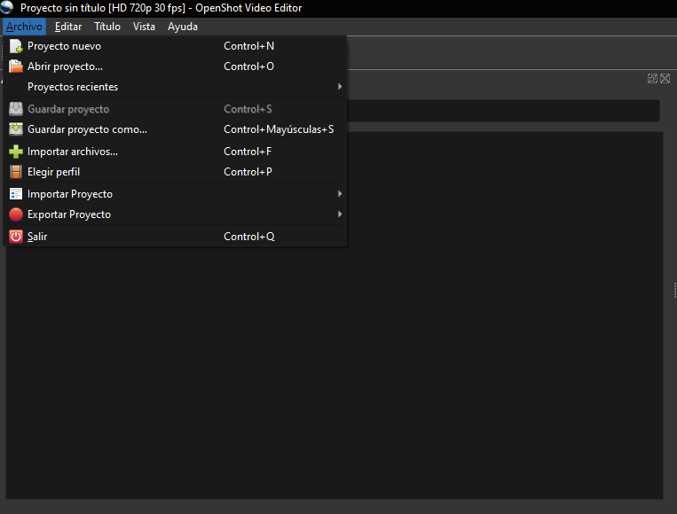
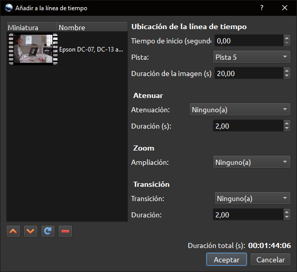
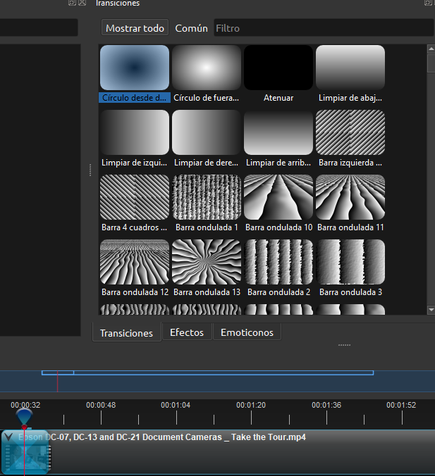
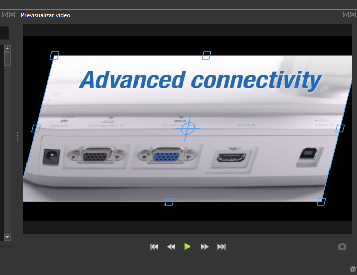

# Uso básico de OpenShot

Una vez instalado OpenShot te guiarán por un pequeño tutorial la primera vez que pases por las diferentes secciones del programa.

## Importar vídeos, imágenes y audio a OpenShot

Para importar archivos multimedia a OpenShot sigue los siguientes pasos:

1. Haz clic en Archivo > Importar archivos...

También puedes importar archivos pulsando clic derecho en el panel de **Archivos del proyecto**.

Una vez aquí, elige los archivos a importar. Recuerda que puedes importar la mayoría de formatos de vídeo, imagen y audio.

## Añadir archivos a la línea de tiempo

Para editar un archivo, necesitaremos añadirlo a la línea de tiempo, arrastrándolo a esta o pulsando clic derecho en este desde el panel de Archivos del proyecto y pulsando en **Añadir a la línea de tiempo**. Nos aparecerá una ventana en la que podremos indicar en qué segundo exacto de la línea de tiempo queremos añadir el clip, si queremos añadirle una atenuación en la entrada y su duración, si queremos ampliar el clip aplicándole un zoom, o si queremos añadir una transición con una duración específica.

Podemos añadir múltiples archivos al mismo tiempo a la línea de tiempo seleccionando ambos y realizando el mismo proceso anterior.

## Edición básica en la línea de tiempo

Una vez tienes los clips en la línea de tiempo, puedes realizar múltiples funciones básicas de edición. Estas son algunas de ellas:

- Recortar y alargar la duración del clip: Para ello, basta con arrastrar desde los extremos inicio y final del vídeo.
- Dividir un clip: Para ello, puedes situar el marcador de tiempo en el momento exacto en el que quieras recortar y pulsar la tecla ++S++. También puedes pulsar la tecla ++R++ para cambiar al modo navaja, y pulsar en las zonas del clip en las que quieras realizar una división.
- Añadir efectos o transiciones a un clip: Para añadir transiciones y efectos que incluye OpenShot a un clip, haz clic en la pestaña Efectos o en la pestaña Transiciones, elige una transición o efecto y arrástralo a la zona del clip en la que quieras añadirlo.

- Transformar clip: Para modificar el tamaño y la posición o perspectiva del clip, selecciona el clip y modifica este usando los puntos de referencia en la vista previa.

- Añadir pistas: Puedes añadir más pistas a la línea de tiempo pulsando el botón verde más.
- Añadir marcador: Los marcadores son muy útiles para seguir la pista de los momentos clave de tu vídeo. Puedes añadirlos situándote en el segundo en el que quieras añadir un marcador y pulsando el botón verde de marcador, justo al lado de las tijeras, o pulsando ++Ctrl+M++. Puedes navegar entre los marcadores de tu vídeo con los botones de navegación a la izquierda o derecha, justo al lado del botón de marcador.
- Ver propiedades de clips: Si pulsas clic derecho en un clip y eliges la opción **Propiedades**, se abrirá el panel de propiedades, desde el cual puedes ajustar ciertos parámetros de ese vídeo, muchos de ellos puedes ajustarlos sin este panel, pero algunos otros, como la opacidad (Alfa) del vídeo, se configuran desde este panel.

> ¡Ojo! Las propiedades que modifiques en un clip se modificarán a partir del instante en el que te encuentres de ese clip. Si quieres aplicar una propiedad al clip completo, asegúrate de estar situado al principio del clip. Puedes situarte en este pusando la tecla de navegación a la izquierda.

También puedes encontrar algunos ajustes básicos pulsando clic derecho en cualquiera de tus clips, como situar el clip en la esquina derecha con un tamaño reducido, acelerar la velocidad del clip, atenuarlo al inicio, etc.

## Exportar archivos editados

Una vez has recortado o aplicado los efectos y transiciones que querías al vídeo, es hora de exportarlo. Para ello, debes pulsar el botón circular rojo de la barra de herramientas, y se abrirá una ventana en la que podrás elegir el nombre, el formato en el que quieres exportar el fichero y la ruta en la que se guardará. Cuando tengas todo listo, pulsa el botón **Exportar vídeo** y espera a que se complete la renderización. Una vez terminado el proceso, podrás ver tu vídeo editado en la ruta que indicaste.