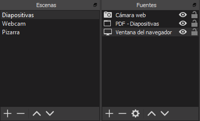
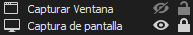
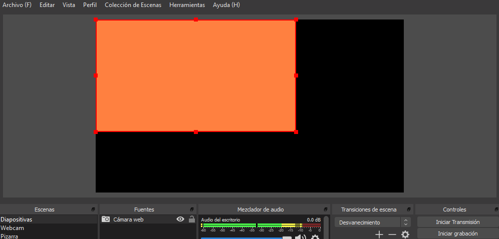

# Escenas y fuentes

Las escenas y fuentes son la base del funcionamiento de OBS. Es aquí donde eliges cómo será el diseño de tu streaming o grabación, añadiendo ventanas, aplicaciones, webcams, imágenes superpuestas, etc.

Haz clic derecho en el panel Escenas o usa los controles del panel inferior para añadir, borrar o reordenar escenas. Si haces clic derecho sobre una escena existente puedes renombrarla, duplicarla, copiar los filtros aplicados sobre esta o incluso mostrarla en un monitor independiente.

Una vez creada la escena, haz clic derecho en el panel Fuentes o usa los controles inferiores para añadir fuentes. Una fuente es cualquier cosa que quieras mostrar o escuchar en tu grabación: cámaras de vídeo, ventanas de aplicaciones, juegos, pantallas, dispositivos de audio, imágenes y galerías de imágenes, texto, páginas web o incluso escenas.

Tras haber experimentado con las posibilidades de las escenas y fuentes, organiza tu colección de escenas para los distintos entornos de grabación o transmisión en directo. Por ejemplo, puedes crear una escena en la que se muestren diapositivas y la cámara web, otra en la que únicamente se muestre la cámara web, y otra en la que se muestre una cámara secundaria conectada al equipo que apunte a una pequeña pizarra.

En el panel de fuentes, puedes bloquear algunas de las fuentes para evitar moverlas involuntariamente mientras editas la escena, y ocultar fuentes en cualquier momento.

En la vista previa, podemos seleccionar y modificar a placer cualquiera de las fuentes (siempre y cuando sean visibles y no estén bloqueadas). Al seleccionar una fuente, esta se remarcará en rojo.

Puedes utilizar los puntos de referencia para cambiar el tamaño de la fuente, por defecto se mantendrá la relación de aspecto.

En caso de querer transformar la fuente sin importar la relación de aspecto, mantén la tecla ++shift++ mientras cambias sus dimensiones. También puedes recortar parte de la fuente manteniendo la tecla ++alt++.

¡Ojo! Ten en cuenta que si cambias la resolución de la base (lienzo) en los ajustes de vídeo más adelante, tendrás que volver a alinear todas las fuentes. En caso de cambiar la resolución de salida (escalada), no habría problema.

Algunos de los atajos de teclado más útiles son:

* Mantener ++ctrl++ para deshabilitar la colisión/alineación entre fuentes.
* ++ctrl+f++ para ajustar a la pantalla.
* ++ctrl+s++ para extender en la pantalla.
* ++ctrl+d++ para centrar en la pantalla.
* ++ctrl+r++ para reiniciar el tamaño y posición de una fuente.
