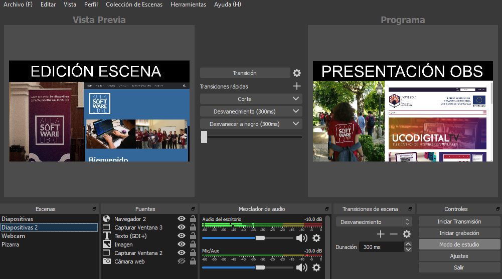

# Modo Estudio

El Modo Estudio puede ser algo confuso al usarlo por primera vez, ya que a primera vista parece dividir la vista previa en dos, pero no es ese el funcionamiento.

El propósito del Modo Estudio, es poder realizar cambios en Escenas sin que los espectadores vean esos cambios en directo, es decir, te permite realizar cambios a una escena para, cuando esté lista, realizar una transición a esta con todos los cambios ya realizados.

En la vista previa de la derecha, podemos ver lo que los espectadores están viendo, en la izquierda, una vista previa editable como la que hay normalmente cuando el Modo Estudio está desactivado. Claro que todo esto no tiene sentido si únicamente tienes una escena, pues los cambios realizados en esta se ven reflejados de forma inmediata.

Una vez realizados los cambios en la escena, basta con usar los controles del panel central entre ambas vistas previas, ya sea mediante el botón de Transición, que la realizaría de forma automática, mediante las Transiciones rápidas, o usando el control deslizante, que permite realizar la transición de forma manual.
